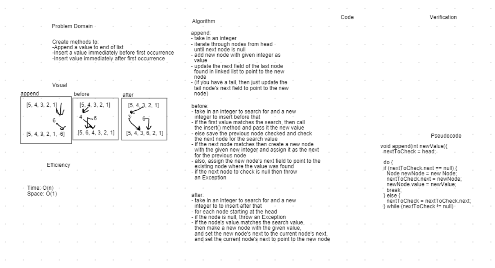

# Singly Linked List

A library for the Linked List data type.

## Challenge

Creating a Linked List class allowing for a collection of values to be updated efficiently. Should create a Node class to represent each point of the collection. The Linked List class should provide methods to insert new Nodes in the head position and search the Nodes for a specific value. The LinkedList should pretty print.

Linked list class should also include append to end, insert before an element, and insert after an element functionality

## Approach & Efficiency

I created a LinkedList class and a Node class. To encapsulate the data in the Node class, I set the fields to private and allowed access to set and get values through the Node's methods. The LinkedList class can be instantiated with a null head field. When the insert method is called, it will set the head field to a new Node and if there was an existing Node then it updates the new Node's next field to point to the previous Node. The include method loops through all existing Nodes and searches for a value returning a boolean. Similarly the toString method loops through all the Nodes to create a representative String.

The append method will iterate through the linked list starting at the head until it finds the last element. It then sets a new node with the passed value after the last element. If there are not elements, then it would also be the first and require that the head field be updated.

The insertBefore method iterates through the list until it finds the given search value. It creates a new node with the passed value and sets its next field to point to the node with the found search value. It also keeps track of the previous node searched so it can update that node's next field to point at the new node. If the list is empty, it calls the insert method to complete its task. If the search value is not present in the list, it throws an exception.

The insertAfter method iterates through the list checking each value. If it finds a node with the search value, it creates a new node with the passed value and points it gets its nexts from the node where the search value was found. It then sets the node found in the search's next field to the new node. If the search value is not found, it throws an exception.

Time Efficiency:
  - insert : O(1)
  - includes : O(n)
  - toSring : O(n)
  - append : O(n)
  - insertBefore : O(n)
  - insertAfter : O(n)

Space Efficiency:
  - insert : O(n)
  - includes : O(1)
  - toSring : O(n)
  - append : O(1)
  - insertBefore : O(1)
  - insertAfter : O(1)

## API

LinkedList Methods:
  - insert : Takes in an integer and stores it in the value field of a new node. Sets the new node as the new head of the linked list and assigns a pointer in the new node to the previous head node.
  - includes : Takes in an integer and checks all nodes for that value. Returns true if it's found, false if not.
  - toString : Returns a string that visually represents the linked list with the node values inside it.
  - append : Takes in an integer and adds a node with that value to the end of the linked list.
  - insertBefore : Takes in an integer to search for and an integer for a new node, if it finds the search value, it places the new node before it, otherwise it throws an exception.
  - insertAfter : Takes in an integer to search for and an integer for a new node, if it finds the search value, it places the new node after it, otherwise it throws an exception.

## Solution

