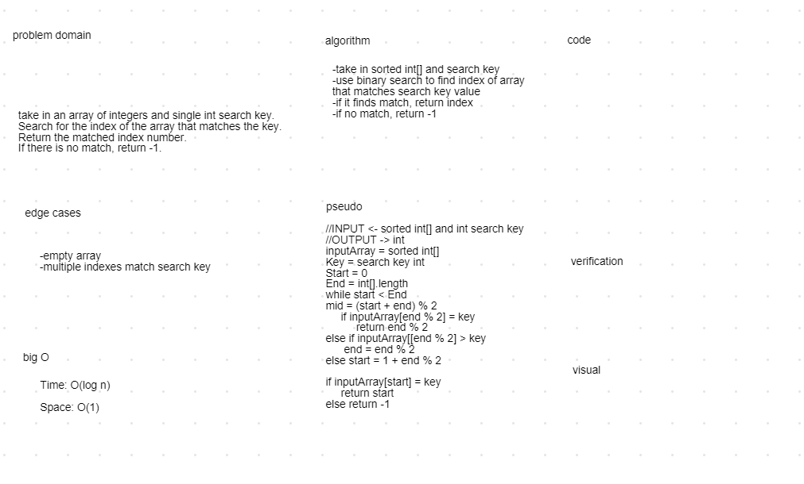

# Binary Shift

Searching a sorted array for a value using binary search.

## Challenge

Take inputs of a sorted integer array and a lone integer value. Search for a value in the array that matches the given integer. Return the index of that value if it exists or -1 if it does not.

## Approach & Efficiency

We started by using integers to save the start and end of the array. If the value at the index of the mid point of the start and end equals the key value, then the index is returned. Otherwise the start or end is adjusted to the mid point depending on whether the value was higher or lower than the key. This repeats until the key is found in a section of the array. If nothing is found then a -1 is returned.

The time complexity is O(log n) because number of operations only increases by 1 for every double the size of the input array.

The excess space complexity is O(1) because no matter the size of the input, the same amount of excess storage will be used.

## Solution

